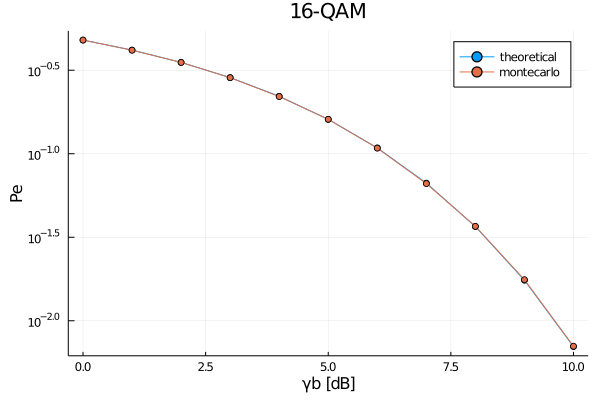

# DigitalCommunications

[](https://zekeriyasari.github.io/DigitalCommunications.jl/stable)
[](https://zekeriyasari.github.io/DigitalCommunications.jl/dev)
[](https://codecov.io/gh/zekeriyasari/DigitalCommunications.jl)
[](https://github.com/zekeriyasari/DigitalCommunications.jl/actions?query=workflow%3ADocumentation)

`DigitalCommunications` focusses on the simulation of digital communication systems. In its very early version, `DigitalCommunications` provides    
1. Monte Carlo simulation of common modulation schemes including PAM, ASK, QAM, PSK, FSK. 
2. Theoretical estimates of probability of symbol error(Pe) versus snr per symbol (γs). 
3. MAP and ML detectors
4. Constellation diagrams 
5. Gray coding. 

# Installation 
`DigitalCommunications` has not been registered package yet. To install it, open a julia repl, type
```
] add https://github.com/zekeriyasari/DigitalCommunications.jl
```

# Example 
Here is an example monte carlo simulation of uncoded 16-QAM, 
```julia 
using DigitalCommunications 

# Simulation parameters 
k = 4 
M = 2^k 
nsymbols = Int(1e6) 
nbits = k * nsymbols
γb = collect(0 : 10)        # Snr per bit 
γs = γb .+ 10 * log10(k)    # Snr ber symbol  

# Communcation system components  
gen = Generator(nbits) 
modulator = Modulator(QAM(M))
channel = AWGNChannel(1) 
detector = MLDetector(alphabet(modulator))

# Monte Carlo simulation 
message = stream_to_symbols(modulator, gen.bits)  # Message signal 
symerr = zeros(length(γs))
for i in 1 : length(symerr)
    channel.snr = γs[i]  # Update channel snr
    mbar = gen.bits |> modulator |> channel |> detector  # Extracted message signal 
    symerr[i] = sum(mbar .!= message) / length(message)  # Symbol error rate 
end

# Plots
using Plots 
plt = plot(title="$M-QAM", xlabel="γb [dB]", ylabel="Pe") 
plot!(γb, berqam.(γb, M), marker=:circle, yscale=:log10, label="theoretical")
plot!(γb, symerr, marker=:circle, yscale=:log10, label="montecarlo")
```
The resulting probability of symbol error versus snr per symbols plot is shown below. 
```
<center>
    
</center>
```
For more information about how to use `DigitalCommunications`, see its [](https://zekeriyasari.github.io/DigitalCommunications.jl/stable).

# Contribution 
Any form of contribution is welcome. Please feel free to open an [issue](https://github.com/zekeriyasari/DigitalCommunications.jl/issues) for bug reports, feature requests, new ideas and suggestions etc., or to send a pull request for any bug fixes.
